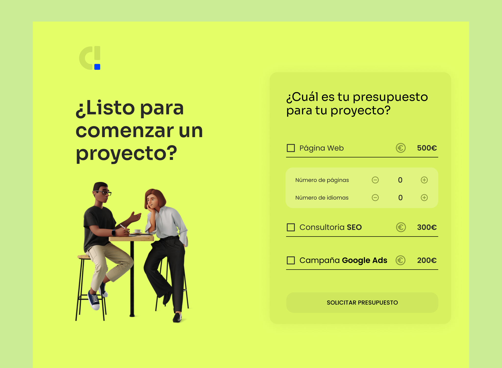
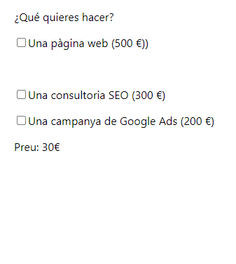

# Sprint 7. React II 



### ****[Live Site]( https://react-sprint7.netlify.app//)****

### **🎯 Objetivos generales**

- Conoce cuáles son las funciones básicas de React.

### **🎯 Objetivos específicos**

- Repasar los componentes y cerca de React.
- Practicar Hook. useEffect.
- Styled-componentes.
- Utilizar localStorage.
- Utilizar rutas de React.
- Filtros y buscador sobre listados.

### **📌 Descripción**

Aplicación para calcular el presupuesto de una página web, añadiendo más interacciones con el usuario que en la práctica anterior (casillas de selección, inputs, botones). Nuestra web deberá reaccionar y modificar el precio total en función de las opciones que elija el usuario/a.


## ****Nivel I ⭐️****

#### Ejercicio 1

Nuestra aplicación empezará con tres checkboxes mediante los cuales el usuario podrá decidir si desea obtener el presupuesto de una página web (500 €), una campaña SEO (300 €) o una campaña de publicidad (200 €).

En función de las opciones que marque, se mostrará un precio distinto.


Simplemente, tendrás que crear 3 casillas de selección que ejecute una función, pasando a esta función el evento de la casilla de selección, para saber qué casilla de selección ha sido clicada. En función de la casilla de selección que se haya pulsado, deberás modificar el precio total en consecuencia.


 ℹ️ **Importante**

Puedes guardar la situación de cada casilla de selección en estados diferentes para poder calcular el total o se puede crear un único estado en formato array para centralizar la situación de las tres casillas de selección.

Conviene guardar el presupuesto total calculado en un estado.


 - [x] 📬 Entregado


#### Ejercicio 2

Una vez creadas las casillas de selección que permitirán al usuario seleccionar el tipo de servicio que necesita, le ofreceremos la opción de ajustar uno de los servicios: crear una página web, pudiendo elegir el número de páginas y de idiomas .

Para ello, es necesario definir un styled-component llamado Panel que será visible cuando el cliente/a seleccione que desea hacer una página web.

Dentro de este componente, el cliente/a podrá seleccionar el número de páginas y el número de idiomas de la web que desea realizar.

Al coste total de la web deberemos añadir la siguiente cantidad:

- **Número de páginas * el número de idiomas * 30 €**
  


- [x] 📬 Entregado


#### **Ejercicio 3**

Para hacer la vida más fácil al usuario, en lugar de hacerle teclear el número de páginas e idiomas que necesita, le pondremos unos botones a los lados del input para que de forma fácil pueda modificar su selección.

Para ellos, debes cambiar los ```<input type = "texto" />``` del panel por un nuevo componente hecho a medida, que tendrá botones de incrementar y decrementar la cantidad, además de un cuadro de texto en el que podremos escribir la cantidad directamente:




- [x] 📬 Entregado


####  **Ejercicio 4**

Ya casi has completado la base del proyecto, te falta guardar los datos de los campos seleccionados por el usuario/a en localstorage.

Debes usar el hook **useEffect**  para cargar los datos del **localtorage** cuando se inicie el componente.


- [x] 📬 Entregado


#### **Ejercicio 5**

Para terminar esta primera fase del proyecto, es necesario implementar una pantalla de bienvenida por el usuario/a, donde se explique el propósito y funcionamiento de la web.

Es necesario que implementes la navegación entre vistas utilizando el routing de React.


- [x] 📬 Entregado

***


## ****Nivel II ⭐️⭐️****


#### **Ejercicio 6**

Siempre hay personas despistadas que podrán utilizar tu web de presupuestos. Para garantizar que todo el mundo entiende el significado de los inputs de número de páginas y de idiomas, tendrás que implementar un botón que abra un popup de ayuda.

Tienes que crear un nuevo componente, consistente en un botón que cuando es pulsado mostrará un popup de información, que contenga una descripción del servicio y el número de páginas seleccionadas por el usuario:


- [x] 📬 Entregado


#### **Ejercicio 7**

Ya has completado la web, pero sólo funciona para realizar un único presupuesto. Como esta web está pensada para que también los programadores/as freelance puedan generar sus presupuestos, falta dar la opción al usuario/a para que pueda generar varios presupuestos.

Para ello, deberás añadir dos inputs: nombre de presupuesto y cliente, que junto con el servicio seleccionado por el usuario y el precio total calculado, deberá añadirse a un listado de presupuestos en la parte derecha de la pantalla.

A la hora de añadir el presupuesto al listado, debe añadirse la fecha mediante el constructor new Date().

Los ítems de este listado deben contener todos los datos citados anteriormente.


 - [ ] 📪 Entregado


#### **Ejercicio 8**

En este ejercicio deberás implementar 3 botones en la parte superior del listado, que efectúan las siguientes tareas:

- Botón ordenar alfabéticamente los presupuestos.
- Botón ordenar por fecha los presupuestos.
- Botón reinicializar el orden.

 - [ ]  📪 Entregado
  


#### **Ejercicio 9**

Ordenando los presupuestos gracias al ejercicio anterior, facilita mucho la vida a los usuarios/as, pero todavía no es suficiente.

Se necesita implementar un buscador de presupuestos, que busca en todos los nombres de los presupuestos para mostrar sólo los que concuerdan.

 - [ ]  📪 Entregado


**Ejercicio 10**

Al igual que en el ejercicio 4 has implementado localstorage para guardar las preferencias de los servicios introducidos por el usuario/a, en este apartado debes implementar la persistencia del listado de presupuestos generados.

 - [ ]  📪 Entregado


***

## ****Nivel III ⭐️⭐️⭐️****

**Ejercicio 11**

Nos falta tener la capacidad de que el usuario pueda compartir la URL de un presupuesto y que al receptor le salga la pantalla cumplimentada. En muchas ocasiones un servicio se contrata por recomendación, por lo que es fundamental tenerlo implementado.

Al ir seleccionando cada una de las opciones del presupuesto, la URL de la misma debe cambiar en función de estos cambios. De esta forma, si el cliente comparte la URL con alguien, éste podrá visualizar las mismas opciones del presupuesto.


 - [ ]  📪 Entregado